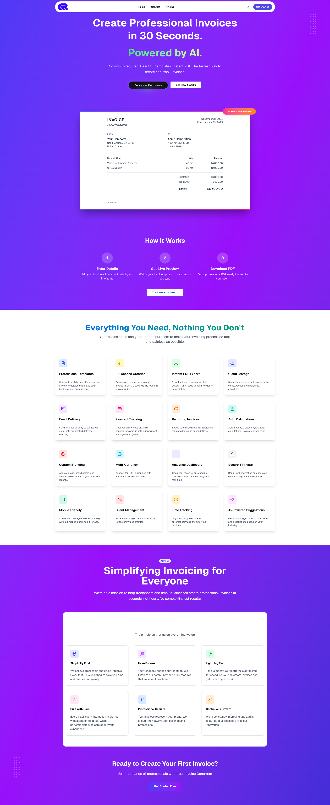
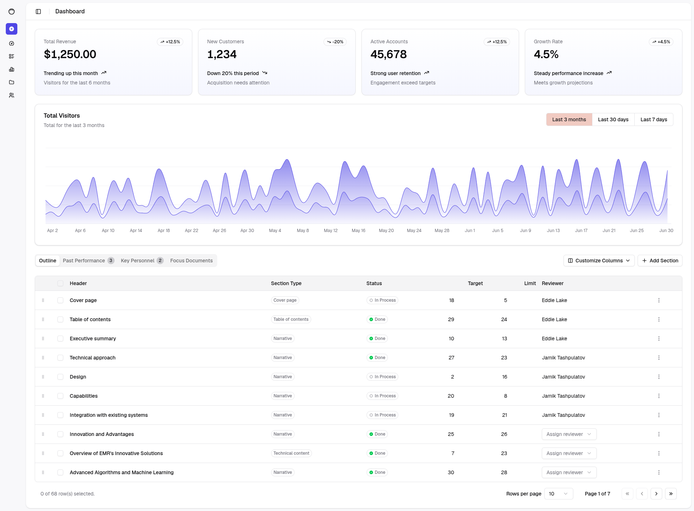
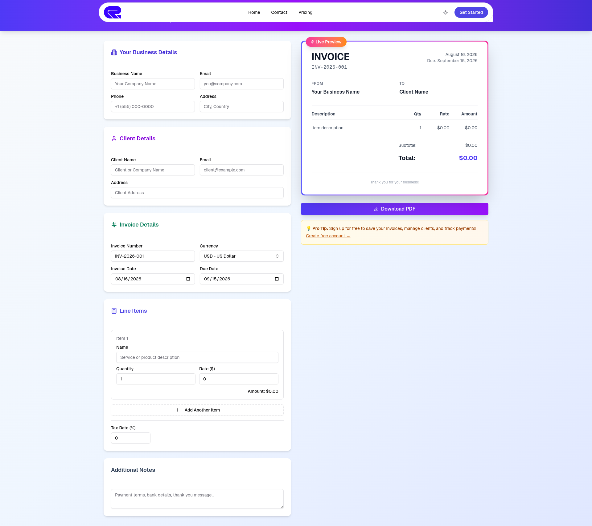

# BizPilot

**Your business, on autopilot.**

A mini ERP for small businesses built with Next.js and Supabase. Send professional invoices, manage clients and inventory, track expenses and payments, and see what your business is really earning — all from one dashboard.

## Features

- **Invoices**: Create, send, and track invoices with or without logging in. Partial payments supported.
- **Clients**: A lightweight CRM with lifetime value and outstanding balances per client.
- **Products & Inventory**: Product catalog with SKU, stock tracking, and low-stock alerts.
- **Expenses**: Categorize spending and see net profit at a glance.
- **Reports**: Revenue vs. expenses over time, expense breakdowns by category, top clients.
- **Team & RBAC**: Invite members with granular role-based permissions (owner, admin, editor, viewer).
- **Billing & Subscriptions**: Tiered subscription plans (Free, Starter, Pro, Enterprise) powered by Stripe with automated entitlement enforcement.
- **Transactional Emails & PDF**: Async Celery email dispatch for invoice delivery with PDF attachments, payment receipts, team invites, and password resets.
- **Authentication**: Secure email + Google OAuth authentication with Django JWT and dual-session support.
- **PDF Generation**: Server-side ReportLab and client-side PDF invoice generation.
- **Responsive Design**: Clean and dynamic interface built with Tailwind CSS and Radix UI.

## Screenshots

### Home Page


### Dashboard


### Create Invoice (Without Login)


## Tech Stack

- **Framework**: Next.js 16.1.1 (React 19, App Router)
- **Backend API**: Django 6 / Django REST Framework with SimpleJWT, Celery, and Redis
- **Billing**: Stripe (Checkout, Customer Portal, Webhooks)
- **Styling**: Tailwind CSS v4, Radix UI, Framer Motion
- **Database & Auth**: PostgreSQL / Django ORM + Supabase compatibility
- **Forms**: React Hook Form with Zod validation
- **PDF Generation**: ReportLab / `@react-pdf/renderer`

## Running Locally

1. **Clone the repository:**
   ```bash
   git clone https://github.com/Afzal20/bizpilot.git
   cd bizpilot
   ```

2. **Install dependencies:**
   We recommend using `pnpm` as the lockfile is present.
   ```bash
   pnpm install
   ```

3. **Set up environment variables:**
   Copy the example environment file and fill in your details:
   ```bash
   cp .env.example .env.local
   ```
   *See the Database Setup section below to get the required Supabase keys.*

4. **Run the development server:**
   ```bash
   pnpm run dev
   ```
   The application will be available at `http://localhost:3000`.

## Database Setup

This project uses [Supabase](https://supabase.com/) for its database and authentication. You can set it up either locally or in the cloud.

### Option A: Local Setup (Recommended for Development)

1. **Install Supabase CLI** (if not already installed globally):
   The CLI is included in the project's dev dependencies.
   ```bash
   pnpm add -D supabase
   ```

2. **Start Supabase Locally:**
   ```bash
   npx supabase start
   ```
   This command uses Docker to start the Supabase stack locally. It will output your `API URL` and `anon key`.

3. **Update Environment Variables:**
   Copy the provided `API URL` and `anon key` into your `.env.local` file:
   ```env
   NEXT_PUBLIC_SUPABASE_URL=http://127.0.0.1:54321
   NEXT_PUBLIC_SUPABASE_PUBLISHABLE_KEY=your_local_anon_key
   ```

4. **Apply Migrations:**
   Push the database schema to your local instance:
   ```bash
   npx supabase db push
   ```
   *You can access the local Supabase Studio at `http://127.0.0.1:54323`.*

### Option B: Cloud Setup (For Production)

1. **Create a Supabase Project:**
   Sign up at [Supabase](https://supabase.com/) and create a new project.

2. **Get API Keys:**
   Go to **Project Settings -> API** to find your `Project URL` and `anon public` key. Add these to your `.env.local` (or production environment variables).

3. **Set Up Google OAuth (Optional but needed for Login):**
   - Create OAuth credentials in the [Google Cloud Console](https://console.cloud.google.com/).
   - Add the Client ID and Secret to your `.env.local`.
   - In your Supabase dashboard, go to **Authentication -> Providers -> Google** and configure it with the same Client ID and Secret.

4. **Push Schema to Cloud:**
   Link your local repository to your Supabase project and push the schema:
   ```bash
   npx supabase link --project-ref <your-project-ref>
   npx supabase db push
   ```

## Roadmap

The following are known gaps that will be addressed in future releases. Honest transparency helps clients make informed decisions.

- **Payment gateway**: The pricing page describes subscription tiers, but no Stripe or other payment processor is integrated yet. Billing is currently manual.
- **Single currency default**: Invoices store a currency field per invoice, but there is no automatic currency conversion or multi-currency reporting. All dashboard totals are summed as-is.
- **Team invite emails**: Inviting a teammate creates a pending record in the database, but no email is sent (no SMTP/transactional email provider configured yet). Invite links must be shared manually.
- **Email invoice delivery**: PDF invoices can be downloaded, but "send invoice by email" is a UI affordance not yet wired to an email backend.

## License

MIT
